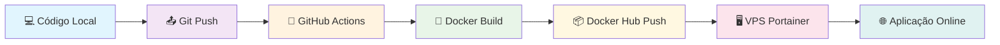

# 🚀 Deploy VPS - Processo Completo

## 📋 Visão Geral
Este documento descreve o processo completo de deploy da aplicação PWA no VPS usando Docker, GitHub Actions, Docker Hub e Portainer.

## 🔄 Fluxo Completo de Deploy



## 🛠️ Configuração Inicial

### 1. **Secrets no Portainer**
Configure os seguintes secrets no Portainer:
- `VITE_SUPABASE_URL`
- `VITE_SUPABASE_SERVICE_ROLE_KEY`
- `VITE_SUPABASE_SCHEMA`

### 2. **Stack Configuration**
```yaml
version: "3.7"

services:
  bi-beta:
    image: oficialmedpro/oficialmed-pwa:beta
    networks:
      - OficialMed
    
    environment:
      - VITE_SUPABASE_URL_FILE=/run/secrets/VITE_SUPABASE_URL
      - VITE_SUPABASE_SERVICE_ROLE_KEY_FILE=/run/secrets/VITE_SUPABASE_SERVICE_ROLE_KEY
      - VITE_SUPABASE_SCHEMA_FILE=/run/secrets/VITE_SUPABASE_SCHEMA
    
    secrets:
      - VITE_SUPABASE_URL
      - VITE_SUPABASE_SERVICE_ROLE_KEY
      - VITE_SUPABASE_SCHEMA
    
    deploy:
      # ... resto da configuração

secrets:
  VITE_SUPABASE_URL:
    external: true
  VITE_SUPABASE_SERVICE_ROLE_KEY:
    external: true
  VITE_SUPABASE_SCHEMA:
    external: true
```

## 🚀 Processo de Deploy

### **Passo 1: Desenvolvimento Local**
```bash
# Fazer mudanças no código
git add .
git commit -m "feat: nova funcionalidade"
git push origin main
```

### **Passo 2: GitHub Actions (Automático)**
- ✅ Detecta push para `main`
- ✅ Executa build do Docker
- ✅ Cria imagem com tag `beta` e `latest`
- ✅ Faz push para Docker Hub

### **Passo 3: Docker Hub (Automático)**
- ✅ Imagem `oficialmedpro/oficialmed-pwa:beta` atualizada
- ✅ Imagem `oficialmedpro/oficialmed-pwa:latest` atualizada
- ✅ Pronta para pull no VPS

### **Passo 4: VPS Portainer (Manual)**
1. **Acessar Portainer** → `https://seu-vps:9443`
2. **Ir em Images** → Buscar `oficialmedpro/oficialmed-pwa:beta`
3. **Clicar em Pull** → Aguardar download
4. **Ir em Stacks** → Selecionar stack `bi-beta`
5. **Clicar em Update** → Aplicar mudanças
6. **Verificar logs** → Confirmar funcionamento

## 🔧 Como Funciona a Injeção de Variáveis

### **docker-entrypoint.sh**
```bash
#!/bin/sh
# 1. Lê secrets do Portainer
VITE_SUPABASE_URL=$(cat /run/secrets/VITE_SUPABASE_URL)
VITE_SUPABASE_SERVICE_ROLE_KEY=$(cat /run/secrets/VITE_SUPABASE_SERVICE_ROLE_KEY)
VITE_SUPABASE_SCHEMA=$(cat /run/secrets/VITE_SUPABASE_SCHEMA)

# 2. Injeta no HTML
sed -i "s|</head>|<script>window.ENV = { VITE_SUPABASE_URL: '${VITE_SUPABASE_URL}', VITE_SUPABASE_SERVICE_ROLE_KEY: '${VITE_SUPABASE_SERVICE_ROLE_KEY}', VITE_SUPABASE_SCHEMA: '${VITE_SUPABASE_SCHEMA}' };</script></head>|" /usr/share/nginx/html/index.html

# 3. Inicia nginx
exec nginx -g "daemon off;"
```

### **src/config/supabase.js**
```javascript
// Lê de window.ENV (injetado em runtime)
const supabaseUrl = import.meta.env.VITE_SUPABASE_URL ||
                   window.ENV?.VITE_SUPABASE_URL ||
                   'fallback-url';

const supabaseServiceKey = import.meta.env.VITE_SUPABASE_SERVICE_ROLE_KEY ||
                          window.ENV?.VITE_SUPABASE_SERVICE_ROLE_KEY ||
                          'fallback-key';
```

## 📊 Status das Imagens

| Ambiente | Imagem | Status | Secrets |
|----------|--------|--------|---------|
| **Beta** | `oficialmedpro/oficialmed-pwa:beta` | ✅ Funcionando | ✅ Configurados |
| **Produção** | `oficialmedpro/oficialmed-pwa:latest` | ✅ Funcionando | ✅ Configurados |

## 🎯 Vantagens da Solução

### **🔒 Segurança**
- Secrets criptografados no Portainer
- Nunca expostos em logs ou código
- Controle de acesso granular

### **🔄 Automatização**
- Deploy com 1 comando (`git push`)
- Zero configuração manual por deploy
- GitHub Actions + Docker Hub + Portainer

### **🌍 Flexibilidade**
- Funciona em qualquer ambiente
- Fácil troca de valores sem rebuild
- Suporte a múltiplos ambientes

### **📱 Manutenibilidade**
- Código limpo e organizado
- Documentação completa
- Processo padronizado

## 🚨 Troubleshooting

### **Erro: "VITE_SUPABASE_URL não encontrada"**
- ✅ Verificar se secrets estão configurados no Portainer
- ✅ Verificar se stack está usando os secrets
- ✅ Verificar logs do container para injeção

### **Erro: "Container não inicia"**
- ✅ Verificar se secrets existem no Portainer
- ✅ Verificar permissões dos secrets
- ✅ Verificar sintaxe do docker-entrypoint.sh

### **Erro: "Imagem não atualiza"**
- ✅ Fazer pull da nova imagem no Portainer
- ✅ Reiniciar o container
- ✅ Verificar se GitHub Actions completou

## 📝 Checklist de Deploy

- [ ] Código commitado e pushed
- [ ] GitHub Actions executou com sucesso
- [ ] Imagem disponível no Docker Hub
- [ ] Pull da nova imagem no Portainer
- [ ] Stack atualizada com nova imagem
- [ ] Container reiniciado
- [ ] Logs verificados
- [ ] Aplicação funcionando

## 🎉 Conclusão

**Problema das variáveis de ambiente: RESOLVIDO PARA SEMPRE!**

Agora você pode fazer deploys de forma:
- **Segura** 🔒
- **Automática** 🤖
- **Confiável** ✅
- **Escalável** 📈

**Apenas: `git add .` → `git commit` → `git push` → Deploy automático!** 🚀
