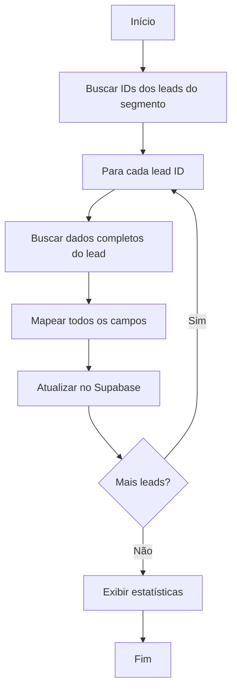

# 🔄 Atualização Completa de Leads por Segmento

## 📋 Descrição

Script para **atualizar leads existentes** de um segmento específico com **todos os campos disponíveis** da API do SprintHub, usando o endpoint individual de leads com `allFields=1`.

## 🎯 Objetivo

Este script é a **segunda etapa** da sincronização por segmento:

1. **Primeira etapa** (`sync-leads-by-segment.js`): Insere leads básicos com campo `segmento`
2. **Segunda etapa** (`update-full-leads-by-segment.js`): Atualiza com dados completos

## 🚀 Uso

```bash
node src/sincronizacao/segmento/update-full-leads-by-segment.js [ID_DO_SEGMENTO]
```

### Exemplo:
```bash
node src/sincronizacao/segmento/update-full-leads-by-segment.js 123
```

## 🔧 Como Funciona

### Fluxo de Execução:



### Etapas Detalhadas:

#### 1️⃣ Busca de IDs do Segmento
```http
POST /leadsfromtype/segment/{segmentId}
Body: { "query": "{total,leads{id}}", "limit": 1000 }
```
- Busca apenas os **IDs** dos leads (rápido)
- Até 1000 leads por vez

#### 2️⃣ Busca de Dados Completos
```http
GET /leads/{leadId}?allFields=1&i=oficialmed
```
- Para **cada lead**, busca todos os campos
- Delay de 500ms entre cada lead (evitar rate limit)

#### 3️⃣ Mapeamento Completo
Mapeia **79 campos** da tabela `api.leads`:
- 👤 Dados pessoais (firstname, lastname, email, phone, etc.)
- 📍 Endereço completo (city, state, country, zipcode, etc.)
- 🏢 Dados comerciais (company, owner, stage, points, etc.)
- 📊 Classificação (categoria, grau_de_interesse, etc.)
- 🎯 Marketing (origem, plataforma, criativo, etc.)
- 💰 Financeiro (capital_de_investimento, tipo_de_compra, etc.)
- 📄 Documentos (cpf, rg, arquivo_receita, etc.)
- E muito mais...

#### 4️⃣ Atualização no Supabase
```http
PATCH /rest/v1/leads?id=eq.{leadId}
Body: { ...todos_os_campos_mapeados }
```

## 📊 Campos Mapeados

### 🔑 Chave Primária
- `id` (BIGINT)

### 👤 Dados Pessoais Básicos
- `firstname`, `lastname`, `email`, `phone`, `whatsapp`, `mobile`, `photo_url`

### 📍 Endereço
- `address`, `city`, `state`, `country`, `zipcode`, `timezone`
- `bairro`, `complemento`, `numero_entrega`, `rua_entrega`

### 🏢 Dados Comerciais
- `company`, `points`, `owner`, `stage`, `preferred_locale`

### 📋 Controle de Acesso
- `user_access` (JSONB), `department_access` (JSONB), `ignore_sub_departments`

### 📅 Datas e Controle
- `create_date`, `updated_date`, `last_active`
- `created_by`, `created_by_name`, `created_by_type`
- `updated_by`, `updated_by_name`, `synced_at`

### 🗂️ Dados Extras
- `archived`, `third_party_data` (JSONB)

### 💰 Financeiro e Investimentos
- `capital_de_investimento`, `tipo_de_compra`, `pedidos_shopify`

### 📊 Classificação e Avaliação
- `categoria`, `classificacao_google`, `grau_de_interesse`, `star_score`
- `avaliacao_atendente`, `avaliacao_atendimento`, `qualificacao_callix`

### 🎯 Marketing e Origem
- `origem`, `origem_manipulacao`, `lista_de_origem`
- `criativo`, `plataforma`, `redes_sociais`, `site`

### 📞 Atendimento
- `atendente`, `atendente_atual`, `feedback`, `observacao`
- `observacoes_do_lead`, `comportamento_da_ia`, `retorno`

### 🏥 Dados Específicos
- `prescritor`, `produto`, `drograria`, `data_recompra`, `mes_que_entrou`

### 📄 Documentos e Identificação
- `cpf`, `rg`, `arquivo_receita`, `id_t56`

### 👥 Dados Pessoais Extras
- `empresa`, `sexo`, `data_de_nascimento`
- `objetivos_do_cliente`, `perfil_do_cliente`, `recebedor`

### 📱 WhatsApp e Integrações
- `whatsapp_remote_lid`

### 📋 Status e Controle
- `status`, `sh_status`, `data_do_contato`

### 🏷️ Segmento
- `segmento` (INTEGER) - ID do segmento

## ⚙️ Configuração

### Variáveis de Ambiente Necessárias:

```env
# SprintHub
VITE_SPRINTHUB_BASE_URL=sprinthub-api-master.sprinthub.app
VITE_SPRINTHUB_API_TOKEN=9ad36c85-5858-4960-9935-e73c3698dd0c
VITE_SPRINTHUB_INSTANCE=oficialmed

# Supabase
VITE_SUPABASE_URL=https://seu-projeto.supabase.co
VITE_SUPABASE_ANON_KEY=sua-chave-anonima
```

### Parâmetros de Configuração:

```javascript
PAGINATION: {
  limit: 1000,           // Máximo de IDs por busca
  delayBetweenPages: 2000,  // 2 segundos entre páginas
  delayBetweenLeads: 500    // 500ms entre cada lead
}
```

## 📈 Performance e Otimização

### Tempo Estimado:
- **90 leads**: ~1 minuto (500ms por lead + processamento)
- **1000 leads**: ~10-15 minutos

### Otimizações Implementadas:
- ✅ Busca inicial apenas com IDs (rápido)
- ✅ Delay entre leads (evitar rate limit)
- ✅ Progress bar em tempo real
- ✅ Tratamento de erros individual por lead
- ✅ Continua processando mesmo com erros

### Rate Limiting:
- **Delay padrão**: 500ms entre leads
- **Ajustável**: Modificar `CONFIG.PAGINATION.delayBetweenLeads`
- **Recomendado**: Não reduzir abaixo de 300ms

## 📊 Exemplo de Saída

```
============================================================
📊 ATUALIZAÇÃO COMPLETA DE LEADS DO SEGMENTO 123
============================================================

🔍 Buscando IDs dos leads do segmento 123...
✅ Encontrados 90 leads no segmento
🚀 Iniciando atualização de 90 leads...

[████████████████████████████████████████] 100% (90/90) Lead ID: 59544

============================================================
✅ ATUALIZAÇÃO CONCLUÍDA!

📊 Estatísticas:
   - Leads no segmento: 90
   - Leads processados: 90
   - Leads atualizados: 88
   - Erros: 2
   - Tempo total: 67.3s
   - Taxa de sucesso: 97.8%
============================================================
```

## 🚨 Tratamento de Erros

### Erros Tratados:

1. **Lead não encontrado**: Continua para o próximo
2. **Timeout na API**: Registra erro e continua
3. **Erro de mapeamento**: Logs detalhados do campo
4. **Erro do Supabase**: Exibe mensagem específica
5. **Rate limit**: Delay automático entre requisições

### Logs de Erro:
```
❌ Erro ao processar lead 112523: Timeout na API
❌ Erro ao atualizar lead 102748: Campo inválido
```

## 🔄 Fluxo Completo de Sincronização

### Uso Recomendado:

```bash
# 1️⃣ PRIMEIRA ETAPA: Inserir leads básicos
node src/sincronizacao/segmento/sync-leads-by-segment.js 123

# 2️⃣ SEGUNDA ETAPA: Atualizar com dados completos
node src/sincronizacao/segmento/update-full-leads-by-segment.js 123
```

### Por que duas etapas?

1. **Primeira etapa** é **rápida**: Insere apenas campos essenciais
2. **Segunda etapa** é **completa**: Busca todos os dados detalhados
3. **Separação** permite:
   - Inserir leads rapidamente no banco
   - Atualizar com detalhes depois (pode falhar sem perder leads)
   - Rodar primeira etapa com frequência
   - Rodar segunda etapa periodicamente

## 🆘 Troubleshooting

### Problema: "Lead não encontrado"
- **Causa**: Lead foi deletado ou não existe mais
- **Solução**: Normal, o script continua para o próximo

### Problema: Muitos erros de timeout
- **Causa**: API lenta ou rate limit
- **Solução**: Aumentar `delayBetweenLeads` para 1000ms

### Problema: Campos não atualizados
- **Causa**: Campo não existe na tabela Supabase
- **Solução**: Verificar schema da tabela e adicionar campo se necessário

### Problema: "Body is too large"
- **Causa**: Dados muito grandes (ex: base64 em campos)
- **Solução**: Mapear campos grandes separadamente ou remover do mapeamento

## 💡 Dicas de Uso

### Debug Mode:
```bash
DEBUG=1 node src/sincronizacao/segmento/update-full-leads-by-segment.js 123
```
- Exibe URLs e bodies das requisições
- Útil para troubleshooting

### Teste com Poucos Leads:
Modifique temporariamente o limit na busca de IDs:
```javascript
limit: 10,  // Testar com apenas 10 leads
```

### Monitoramento:
- Acompanhe o progress bar em tempo real
- Taxa de sucesso ideal: > 95%
- Se erros > 10%, investigar

## 📝 Mapeamento de Campos Personalizados

Campos específicos do projeto OficialMed:
- `prescritor`: Médico prescritor
- `produto`: Produto de interesse
- `drograria`: Drogaria associada
- `data_recompra`: Data prevista de recompra
- `qualificacao_callix`: Qualificação do sistema Callix

## 🔮 Melhorias Futuras

- [ ] Batch updates (atualizar múltiplos leads de uma vez)
- [ ] Retry automático para erros temporários
- [ ] Cache de dados para evitar requisições repetidas
- [ ] Modo "incremental" (apenas leads desatualizados)
- [ ] Webhook para notificação de conclusão

## 📞 Suporte

Em caso de dúvidas ou problemas:
1. Verificar logs detalhados
2. Ativar modo DEBUG
3. Verificar configurações de ambiente
4. Testar com segmento pequeno primeiro

---

**Última atualização**: 14 de Janeiro de 2025  
**Versão**: 1.0.0  
**Autor**: Sistema de Sincronização OficialMed

