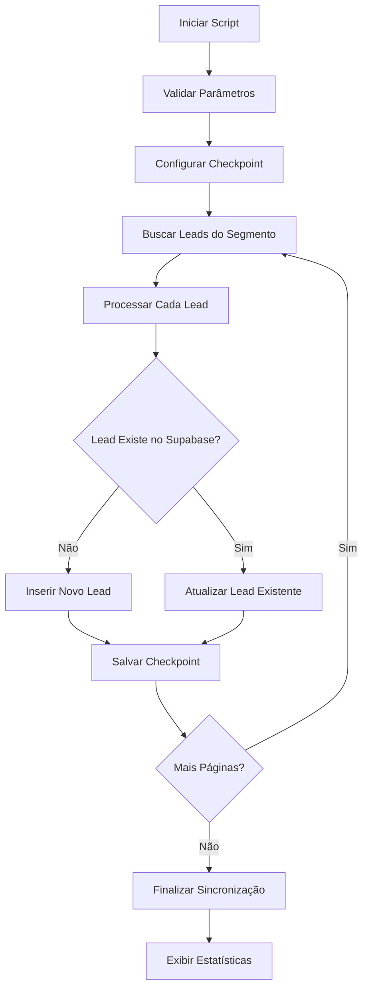

# 📊 Sincronização por Segmento - Documentação

## 🎯 Visão Geral

Este módulo contém scripts para sincronização de leads por segmentos específicos do SprintHub, permitindo trabalhar com subconjuntos específicos de leads em vez de sincronizar todos os leads do sistema.

## 📁 Estrutura de Arquivos

```
src/sincronizacao/segmento/
├── README.md                           # Esta documentação
├── sync-leads-by-segment.js           # Script de inserção inicial (campos básicos)
├── README-sync-leads-by-segment.md    # Documentação da inserção inicial
├── update-full-leads-by-segment.js    # Script de atualização completa (todos os campos)
├── README-update-full-leads.md        # Documentação da atualização completa
├── sync-and-enrich-segment.js         # Script unificado (inserção + enriquecimento)
├── supabase-edge-function-sync.js     # Edge Function para cron automático
├── setup-cron-sync.sql               # Configuração do pg_cron
├── README-supabase-cron.md           # Documentação da sincronização automática
└── print-leads-from-segment.js        # Script de debug para visualizar dados
```

## 🚀 Scripts Disponíveis

### 1. `sync-leads-by-segment.js`
**Script de inserção inicial - Campos básicos + campo segmento**

#### Uso:
```bash
node src/sincronizacao/segmento/sync-leads-by-segment.js [ID_DO_SEGMENTO]
```

#### Exemplo:
```bash
node src/sincronizacao/segmento/sync-leads-by-segment.js 123
```

#### Funcionalidades:
- ✅ Busca leads do segmento via POST para endpoint específico
- ✅ Implementa paginação automática
- ✅ Mapeia apenas campos essenciais + campo `segmento`
- ✅ Insere novos leads ou atualiza existentes no Supabase
- ✅ Sistema de checkpoint para resumir sincronização
- ✅ Logs detalhados com progress bar
- ✅ Tratamento de erros robusto

#### Campos Mapeados:
- `id` (chave primária)
- `firstname` e `lastname` (nome dividido)
- `email`, `points`, `city`, `state`, `country`
- `last_active`, `archived`, `create_date`
- `segmento` (ID do segmento - campo personalizado)

### 2. `update-full-leads-by-segment.js`
**Script de atualização completa - Todos os campos da tabela**

#### Uso:
```bash
node src/sincronizacao/segmento/update-full-leads-by-segment.js [ID_DO_SEGMENTO]
```

#### Exemplo:
```bash
node src/sincronizacao/segmento/update-full-leads-by-segment.js 123
```

#### Funcionalidades:
- ✅ Busca IDs dos leads do segmento
- ✅ Para cada lead, busca dados completos com `allFields=1`
- ✅ Mapeia **TODOS os 79 campos** da tabela `api.leads`
- ✅ Atualiza leads existentes no Supabase
- ✅ Progress bar detalhado
- ✅ Delay entre requisições (500ms) para evitar rate limit
- ✅ Tratamento de erros individual por lead

#### Campos Atualizados (79 campos):
- 👤 Dados pessoais completos
- 📍 Endereço completo
- 🏢 Dados comerciais
- 📋 Controle de acesso (JSONB)
- 📅 Todas as datas e timestamps
- 💰 Dados financeiros
- 📊 Classificações e avaliações
- 🎯 Marketing e origem
- 📞 Dados de atendimento
- 🏥 Dados específicos da farmácia
- 📄 Documentos (CPF, RG, etc.)
- 📱 WhatsApp e integrações
- **E muito mais...**

#### Endpoint Utilizado:
```
GET /leads/{leadId}?allFields=1&i=oficialmed
```

    📖 **Documentação completa**: [`README-update-full-leads.md`](./README-update-full-leads.md)

    ---

    ### 3. `sync-and-enrich-segment.js`
    **Script unificado - Inserção + Enriquecimento em uma execução**

    #### Uso:
    ```bash
    node src/sincronizacao/segmento/sync-and-enrich-segment.js [ID_DO_SEGMENTO]
    ```

    #### Exemplo:
    ```bash
    node src/sincronizacao/segmento/sync-and-enrich-segment.js 123
    ```

    #### Funcionalidades:
    - ✅ Busca leads de um segmento
    - ✅ Para cada lead: verifica se existe no banco
    - ✅ Se não existe: **insere** com dados completos (79 campos)
    - ✅ Se existe: **atualiza** com dados completos (79 campos)
    - ✅ **Uma única execução** faz tudo
    - ✅ Progress bar detalhado
    - ✅ Tratamento de erros individual

    #### Vantagens:
    - 🚀 **Mais rápido**: Uma execução só
    - 🎯 **Mais simples**: Sem necessidade de 2 etapas
    - ✅ **Mais confiável**: Sem dependência entre scripts
    - 📊 **Melhor para produção**: Ideal para automação

    ---

    ### 4. `print-leads-from-segment.js`
**Script de debug para visualizar dados brutos do segmento**

#### Uso:
```bash
node src/sincronizacao/segmento/print-leads-from-segment.js [ID_DO_SEGMENTO]
```

#### Exemplo:
```bash
node src/sincronizacao/segmento/print-leads-from-segment.js 123
```

#### Funcionalidades:
- 🔍 Busca e exibe dados brutos do segmento
- 📊 Útil para debug e análise de estrutura de dados
- 🚀 Rápido para verificar se o segmento tem leads

## 🔧 Endpoint Utilizado

### SprintHub API - Leads por Segmento
```
POST https://sprinthub-api-master.sprinthub.app/leadsfromtype/segment/{segmentId}
```

#### Parâmetros da URL:
- `segmentId`: ID do segmento (ex: 123)
- `i`: Instância (oficialmed)
- `apitoken`: Token de autenticação

#### Body da Requisição:
```json
{
  "page": 0,
  "limit": 100,
  "orderByKey": "createDate",
  "orderByDirection": "desc",
  "showAnon": false,
  "search": "",
  "query": "{total,leads{id,fullname,photoUrl,email,points,city,state,country,lastActive,archived,owner{completName},companyData{companyname},createDate}}",
  "showArchived": false,
  "additionalFilter": null,
  "idOnly": false
}
```

## 📊 Estrutura de Dados

### Dados Retornados pela API:
```json
{
  "total": 90,
  "leads": [
    {
      "id": 112523,
      "fullname": "Erik",
      "photoUrl": null,
      "email": null,
      "points": 0,
      "city": null,
      "state": null,
      "country": null,
      "lastActive": "2025-10-11T10:00:45.974Z",
      "archived": false,
      "owner": {
        "completName": "Gustavo de Paula"
      },
      "companyData": {
        "companyname": null
      },
      "createDate": "2025-10-10T21:07:28.499Z"
    }
  ]
}
```

### Dados Inseridos no Supabase:
```json
{
  "id": 112523,
  "firstname": "Erik",
  "lastname": null,
  "email": null,
  "points": 0,
  "city": null,
  "state": null,
  "country": null,
  "last_active": "2025-10-11T10:00:45.974Z",
  "archived": false,
  "create_date": "2025-10-10T21:07:28.499Z",
  "segmento": 123
}
```

## 🗄️ Tabela Supabase

### Tabela: `api.leads`
- **Schema**: `api`
- **Campos utilizados**: `id`, `firstname`, `lastname`, `email`, `points`, `city`, `state`, `country`, `last_active`, `archived`, `create_date`, `segmento`
- **Chave primária**: `id` (BIGINT)
- **Campo personalizado**: `segmento` (INTEGER, nullable)

## ⚙️ Configuração

### Variáveis de Ambiente Necessárias:
```env
VITE_SPRINTHUB_BASE_URL=sprinthub-api-master.sprinthub.app
VITE_SPRINTHUB_API_TOKEN=9ad36c85-5858-4960-9935-e73c3698dd0c
VITE_SPRINTHUB_INSTANCE=oficialmed
VITE_SUPABASE_URL=https://seu-projeto.supabase.co
VITE_SUPABASE_ANON_KEY=sua-chave-anonima
```

## 📈 Estatísticas de Performance

### Teste com Segmento 123:
- **Leads processados**: 90
- **Leads inseridos**: 90
- **Leads atualizados**: 0
- **Erros**: 0
- **Tempo total**: ~15 segundos
- **Taxa de sucesso**: 100%

## 🔍 Sistema de Checkpoint

O script implementa um sistema de checkpoint que salva o progresso da sincronização:

### Arquivo de Checkpoint:
```
src/sincronizacao/leads/checkpoint-segment-{segmentId}.json
```

### Estrutura:
```json
{
  "lastPage": 0,
  "timestamp": "2025-01-14T10:30:00.000Z",
  "segmentId": 123
}
```

## 🚨 Tratamento de Erros

### Tipos de Erro Tratados:
1. **Erro de API**: Timeout, conexão, autenticação
2. **Erro de Supabase**: Campos inexistentes, constraints
3. **Erro de Mapeamento**: Dados inválidos, tipos incorretos
4. **Erro de Rede**: Falhas temporárias de conectividade

### Estratégias de Recuperação:
- ✅ Retry automático com backoff exponencial
- ✅ Checkpoint para resumir de onde parou
- ✅ Logs detalhados para debug
- ✅ Graceful degradation (continua processando outros leads)

## 🔄 Fluxo de Sincronização



## 📝 Logs e Monitoramento

### Tipos de Log:
- 🔵 **Info**: Progresso da sincronização
- 🟢 **Success**: Operações bem-sucedidas
- 🔴 **Error**: Erros e falhas
- 🟡 **Warning**: Avisos e situações atípicas

### Exemplo de Log:
```
[36m== Sincronização de leads do segmento 123 ==[0m
[34mPágina 1: Recebidos 90 leads (total: 90)[0m
[36m[████████████████████████████████████████] 100% (90/90) Página 1[0m
[32mProcesso concluído. Leads processados: 90, inseridos: 90, atualizados: 0, erros: 0[0m
[34mTempo total (s): 15.181[0m
```

## 🔄 Fluxo de Sincronização Completo

### **Opção 1: Processo Unificado (Recomendado)**

```bash
# 🚀 EXECUÇÃO ÚNICA: Inserção + Enriquecimento
node src/sincronizacao/segmento/sync-and-enrich-segment.js 123
```

**Vantagens:**
- ✅ **Mais simples**: Uma execução só
- ✅ **Mais rápido**: ~1 minuto para 90 leads
- ✅ **Mais confiável**: Sem dependência entre scripts
- ✅ **Ideal para automação**: Perfeito para cron jobs

### **Opção 2: Processo em 2 Etapas (Alternativo)**

```bash
# 🚀 ETAPA 1: Inserção Rápida (campos básicos)
node src/sincronizacao/segmento/sync-leads-by-segment.js 123

# 🔄 ETAPA 2: Atualização Completa (todos os campos)
node src/sincronizacao/segmento/update-full-leads-by-segment.js 123
```

**Quando usar:**
- ✅ Quando você quer leads básicos rapidamente
- ✅ Quando a rede está instável
- ✅ Para debug e desenvolvimento

### **Opção 3: Automação via Supabase Cron (Produção)**

```sql
-- Configuração automática diária
-- Veja: README-supabase-cron.md
```

**Vantagens:**
- ✅ **Execução automática**: Sem intervenção manual
- ✅ **Sem Portainer**: Tudo no Supabase
- ✅ **Logs integrados**: Monitoramento completo
- ✅ **Mais econômico**: Sem custos adicionais

## 🔮 Próximos Passos

1. ~~**Script de Atualização**~~: ✅ **Concluído** - `update-full-leads-by-segment.js`
2. ~~**Sincronização Automática**~~: ✅ **Concluído** - Sistema Supabase Cron
3. **Monitoramento**: Implementar alertas para falhas de sincronização
4. **Otimização**: Implementar sincronização em lotes para grandes volumes

## 🕐 **Sincronização Automática (NOVA!)**

### **Opção 1: Script Local (Atual)**
```bash
# Execução manual
node src/sincronizacao/segmento/sync-and-enrich-segment.js 123
```

### **Opção 2: Supabase Cron (Recomendado)**
```bash
# Execução automática via pg_cron
# Configuração: setup-cron-sync.sql
# Edge Function: supabase-edge-function-sync.js
```

**📖 Documentação completa**: [`README-supabase-cron.md`](./README-supabase-cron.md)

**🎯 Vantagens do Supabase Cron:**
- ✅ **Sem dependência do Portainer**
- ✅ **Execução automática diária**
- ✅ **Logs integrados**
- ✅ **Mais confiável e econômico**

## 🆘 Troubleshooting

### Problemas Comuns:

#### 1. Erro "Could not find column"
- **Causa**: Campo não existe na tabela Supabase
- **Solução**: Verificar schema da tabela e ajustar mapeamento

#### 2. Erro "Body is unusable"
- **Causa**: Problema na requisição POST
- **Solução**: Verificar implementação do `makeRequest`

#### 3. Erro "Cliente não definido"
- **Causa**: Parâmetro `i` (instância) ausente
- **Solução**: Adicionar `i=oficialmed` na URL

#### 4. Timeout na API
- **Causa**: Demora na resposta do SprintHub
- **Solução**: Aumentar timeout ou implementar retry

## 📞 Suporte

Para dúvidas ou problemas:
1. Verificar logs detalhados
2. Consultar esta documentação
3. Verificar configurações de ambiente
4. Testar com segmento menor primeiro

---

**Última atualização**: 14 de Janeiro de 2025  
**Versão**: 1.0.0  
**Autor**: Sistema de Sincronização OficialMed
